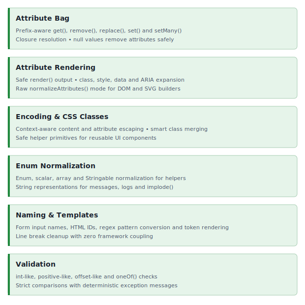

<!-- markdownlint-disable MD041 -->
<p align="center">
    <picture>
        <source media="(prefers-color-scheme: dark)" srcset="https://raw.githubusercontent.com/ui-awesome/.github/refs/heads/main/logo/ui_awesome_dark.png">
        <source media="(prefers-color-scheme: light)" srcset="https://raw.githubusercontent.com/ui-awesome/.github/refs/heads/main/logo/ui_awesome_light.png">
        
    </picture>
    <h1 align="center">Html helper</h1>
    <br>
</p>
<!-- markdownlint-enable MD041 -->

<p align="center">
    <a href="https://github.com/ui-awesome/html-helper/actions/workflows/build.yml" target="_blank">
        
    </a>
    <a href="https://dashboard.stryker-mutator.io/reports/github.com/ui-awesome/html-helper/main" target="_blank">
        
    </a>
    <a href="https://github.com/ui-awesome/html-helper/actions/workflows/static.yml" target="_blank">
        
    </a>
</p>

<p align="center">
    <strong>A powerful PHP library to simplify HTML element creation</strong><br>
    <em>Generate attributes, encode content, sanitize HTML, and manage CSS classes with ease.</em>
</p>

## Features

<picture>
    <source media="(min-width: 768px)" srcset="./docs/svgs/features.svg">
    
</picture>

### Installation

```bash
composer require ui-awesome/html-helper:^0.3
```

### Quick start

#### Rendering HTML attributes

Sorts attributes by priority, handles boolean values, and automatically encodes JSON for complex data.

```php
<?php

declare(strict_types=1);

namespace App;

use UIAwesome\Html\Helper\Attributes;
?>

<?= Attributes::render(
    [
        'id' => 'submit-btn',
        // automatically joined
        'class' => ['btn', 'btn-primary'],
        // `true` booleans are rendered as valueless attributes
        'disabled' => true,
        // `false` booleans are skipped
        'readonly' => false,
        // JSON encoded automatically
        'data' => [
            'id' => 42,
            'options' => ['modal' => true],
        ],
        'style' => [
            'color' => '#fff',
            'margin-top' => '10px'
        ],
    ]
) ?>
// output:
// class="btn btn-primary" id="submit-btn" disabled data-id="42" data-options='{"modal":true}' style='color: #fff; margin-top: 10px;'
```

#### Managing CSS classes

Allows you to merge, add, or override CSS classes within an attributes array smartly.

```php
<?php

declare(strict_types=1);

namespace App;

use UIAwesome\Html\Helper\CSSClass;

$attributes = ['class' => 'base-class'];

// add new classes (merges efficiently)
CSSClass::add($attributes, ['text-center', 'mt-5']);

// override existing classes
CSSClass::add($attributes, 'alert alert-danger', true);

echo $attributes['class'];
// output: alert alert-danger
```

#### Encoding

Ensures your content and attribute values are safe from XSS.

```php
<?php

declare(strict_types=1);

namespace App;

use UIAwesome\Html\Helper\Encode;

// safe Content
echo Encode::content('<script>alert("xss")</script>');
// output: &lt;script&gt;alert("xss")&lt;/script&gt;

// safe Attribute Value
echo Encode::value('Name "Quote"');
// output: Name &quot;Quote&quot;
```

#### Enum normalization

Normalizes values against a predefined set, supporting both arrays and Enums.

```php
<?php

declare(strict_types=1);

namespace App;

use App\Enums\Status;
use UIAwesome\Html\Helper\Enum;

// normalize array of Enums
$result = Enum::normalizeArray([Status::ACTIVE, Status::INACTIVE]);
// ['active', 'inactive']

// normalize mixed array
$result = Enum::normalizeArray(['foo', Status::ACTIVE, 42]);
// ['foo', 'active', 42]

// normalize value from Enum
Enum::normalizeValue(Status::ACTIVE);
// 'active'

// normalize value from mixed
Enum::normalizeValue('foo');
// 'foo'
```

#### Form naming & IDs

Generates standard PHP form names and valid HTML IDs, handling arrayable and nested properties effortlessly.

```php
<?php

declare(strict_types=1);

namespace App;

use UIAwesome\Html\Helper\Naming;

// generate input name (Nested)
echo Naming::generateInputName('User', 'profile[0][email]');
// output: User[profile][0][email]

// generate input ID (Sanitized)
echo Naming::generateInputId('User', 'profile[0][email]');
// output: user-profile-0-email

// convert regex to pattern
echo Naming::convertToPattern('/^[a-z]+$/i');
// output: ^[a-z]+$
```

#### Template rendering

Performs clean token replacement with normalized line endings.

```php
<?php

declare(strict_types=1);

namespace App;

use UIAwesome\Html\Helper\Template;

echo Template::render("Hello, {name}!", ['{name}' => 'Yii3']);
// output: Hello, Yii3!
```

#### Validation

Enforces strict types and approved values for your HTML logic.

```php
<?php

declare(strict_types=1);

namespace App;

use UIAwesome\Html\Helper\Validator;

// validate integer-like string
$isValid = Validator::intLike('123', 0, 1000);

// validate against allowed list (supports Enums)
Validator::oneOf('sm', ['sm', 'md', 'lg'], 'size');
// passes
```

## Documentation

For detailed configuration options and advanced usage.

- 🧪 [Testing Guide](docs/testing.md)

## Package information

[](https://www.php.net/releases/8.1/en.php)
[](https://packagist.org/packages/ui-awesome/html-helper)
[](https://packagist.org/packages/ui-awesome/html-helper)

## Quality code

[](https://codecov.io/github/ui-awesome/html-helper)
[](https://github.com/ui-awesome/html-helper/actions/workflows/static.yml)
[](https://github.com/ui-awesome/html-helper/actions/workflows/linter.yml)
[](https://github.styleci.io/repos/767410135?branch=main)

## Our social networks

[](https://x.com/Terabytesoftw)

## License

[](LICENSE)
